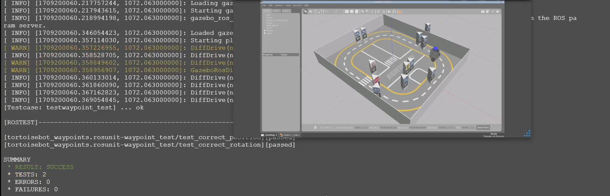

# CheckPoint 16 Quality Assurance

<a name="readme-top"></a>

## About The Project
This project is focused on creating and executing tests for the TortoiseBot robot simulation in both ROS1 and ROS2 environments. The primary goal is to develop a robust testing framework (GTest & Unit Tests) to ensure the functionality and reliability of the waypoints action server, allowing the robot to follow predefined paths accurately.



<!-- GETTING STARTED -->
## Getting Started

### Software Prerequisites
* Ubuntu 22.04
* ROS2 Galactic
* ROS Noetic


<p align="right">(<a href="#readme-top">back to top</a>)</p>

<!-- INSTALLATION -->
### Installation
1. Clone the repo:
   ```sh
   cd ~ && \
   git clone https://github.com/pvela2017/The-Construct-CheckPoint-16-Quality-Assurance
   ```
2. Compile the simulation:
   ```sh
   source /opt/ros/galactic/setup.bash && \
   cd ~/The-Construct-CheckPoint-16-Quality-Assurance/ros2_ws && \
   colcon build
   source /opt/ros/noetic/setup.bash && \
   cd ~/The-Construct-CheckPoint-16-Quality-Assurance/simulation_ws && \
   catkin_ws
   ```
     
<p align="right">(<a href="#readme-top">back to top</a>)</p>


<!-- USAGE -->
## Usage
### Local Simulation
1. Quality assurance ROS1 test:
   ```sh
   source /opt/ros/noetic/setup.bash && \
   source ~/The-Construct-CheckPoint-16-Quality-Assurance/simulation_ws/devel/setup.bash && \
   rostest tortoisebot_waypoints waypoints_test.test
   ```
2. Quality assurance ROS2 test - Simulation:
   ```sh
   source /opt/ros/galactic/setup.bash && \
   source ~/The-Construct-CheckPoint-16-Quality-Assurance/ros2_ws/install/setup.bash && \
   ros2 launch tortoisebot_bringup bringup.launch.py use_sim_time:=True
   ```
3. Quality assurance ROS2 test - Waypoint:
   ```sh
   source /opt/ros/galactic/setup.bash && \
   source ~/The-Construct-CheckPoint-16-Quality-Assurance/ros2_ws/install/setup.bash && \
   ros2 run tortoisebot_waypoints main
   ```
4. Quality assurance ROS2 test - Test:
   ```sh
   source /opt/ros/galactic/setup.bash && \
   source ~/The-Construct-CheckPoint-16-Quality-Assurance/ros2_ws/install/setup.bash && \
   colcon test --packages-select tortoisebot_waypoints --event-handler=console_direct+
   ```

<p align="right">(<a href="#readme-top">back to top</a>)</p>

<!-- RESULTS -->
## Results
[](https://www.youtube.com/watch?v=s4jkbh0bWyQ)

<!-- KEYS -->
## Key topics learnt
* GTest.
* Unit Test.
